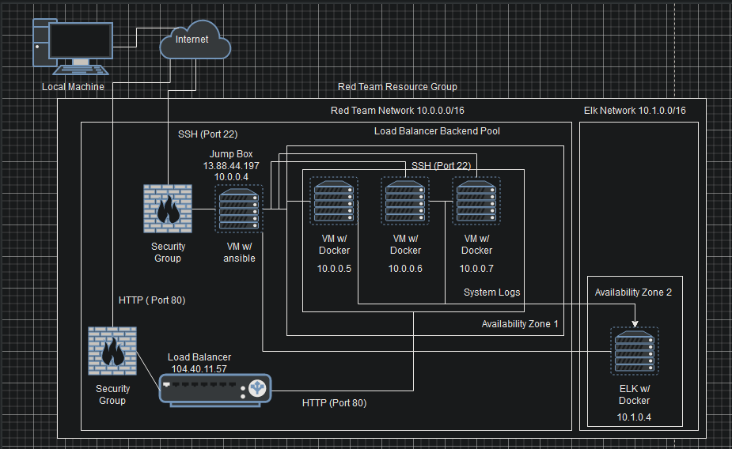
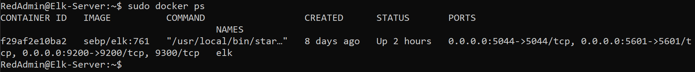

# ELK-Stack-Project
Project 1 - ELK Stack Project

## Automated ELK Stack Deployment

The files in this repository were used to configure the network depicted below.

These files have been tested and used to generate a live ELK deployment on Azure. They can be used to either recreate the entire deployment pictured above. Alternatively, select portions of the docker file may be used to install only certain pieces of it, such as Filebeat.

  

This document contains the following details:
- Description of the Topology
- Access Policies
- ELK Configuration
  - Beats in Use
  - Machines Being Monitored
- How to Use the Ansible Build

### Description of the Topology

The main purpose of this network is to expose a load-balanced and monitored instance of DVWA, the D*mn Vulnerable Web Application.

Load balancing ensures that the application will be highly available, in addition to restricting inbound traffic to the network. The load balancer guarentees that the vulnerable web servers will share the incoming traffic equally. The advantage of a jump box is to restrict access to only authorized users who will be able to connect for the purpose of making any necessary updates.    

Integrating an ELK server allows users to easily monitor the vulnerable VMs for changes to any system data and system metrics. Filebeat is an exporter of log files and monitors and changes made to these files. Similarly metricbeat is an exporter of operating system metrics and service metrics running on the server.    

The configuration details of each machine may be found below.

| Name     | Function   | IP Address | Operating System |
|----------|------------|------------|------------------|
| Jump Box | Gateway    | 10.0.0.4   | Linux            |
| DVWA 1   | Web Server | 10.0.0.5   | Linux            |
| DVWA 2   | Web Server | 10.0.0.6   | Linux            |
| DVWA 3   | Web Server | 10.0.0.7   | Linux            |
| ELK      | Monitoring | 10.1.0.4   | Linux            |

### Access Policies

The machines on the internal network are not exposed to the public Internet. 

Only the jump box machine can accept connections from the Internet. Access to this machine is only allowed from the following IP addresses:
13.88.44.197

Machines within the network can only be accessed by each other. The DVWA 1,2, and 3 send traffic to the ELK server. 

A summary of the access policies in place can be found in the table below.

| Name     | Publicly Accessible | Allowed IP addresses |
|----------|---------------------|----------------------|
| Jump Box | Yes                 | 13.88.44.197         |
| DVWA 1   | No                  | 10.0.0.1-254         |
| DVWA 2   | No                  | 10.0.0.1-254         |
| DVWA 3   | No                  | 10.0.0.1.254         |
| ELK      | No                  | 10.1.0.1-254         |

### Elk Configuration

Ansible was used to automate configuration of the ELK machine. No configuration was performed manually, which is advantageous because the agents are not directly installed on the ELK machine only on the ansible container. The ansible container agents install beats onto the ELK machine for monitoring of the web servers.

The playbook implements the following tasks:
- Installation of the apt packages docker.io and python3-pip. Docker.io is used to run the container and python3-pip is used to install the Python software
- Installation of the pip package docker required by ansible to maintain the state of the Docker containers
- Installation of the sysctl package vm.max_map_count set to 262144 which configures the ELK machine to use more memory required for the ELK container to run.  
- Installation of the Docker_container elk. Configuring the elk container to install the latest version 761, specify specific port mappings, and to always run the container after restart.
- Use the system daemon systemd to enable docker on boot of the ELK machine. 

The following screenshot displays the result of running `docker ps` after successfully configuring the ELK instance.

### Target Machines & Beats
This ELK server is configured to monitor the following machines: DVWA 1, DVWA 2, and DVWA 3 at 10.0.0.5, 10.0.0.6, and 10.0.0.7 respectively. 

We have installed the following Beats on these machines:
-Filebeat
-Metricbeat

These Beats allow us to collect the following information from each machine:
- Filebeat monitors changes made to logfiles. 
- 
- _TODO: In 1-2 sentences, explain what kind of data each beat collects, and provide 1 example of what you expect to see. E.g., `Winlogbeat` collects Windows logs, which we use to track user logon events, etc._

### Using the Playbook
In order to use the playbook, you will need to have an Ansible control node already configured. Assuming you have such a control node provisioned: 

SSH into the control node and follow the steps below:
- Copy the playbook file to etc/ansible/files.
- Update the hosts file to include the specific VM IP address and particular groups to run the playbooks on. In order to make sure to intall the correct playbooks, it is imperative to seperate the VM IP address' into multiple groups. In this case the groups were seperated by the webserver group denoted 'webservers' and the elk group denoted 'elk'.  
- Run the playbook, and navigate to the IP address at port 5601 of the elk machine  to check that the installation worked as expected. 
